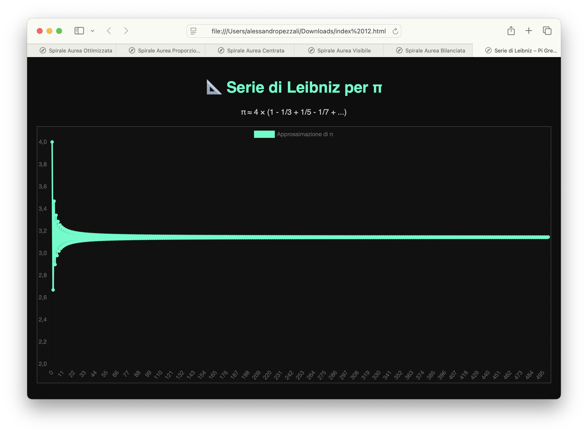

# 📊 Visualizzatore Formule

Una **Progressive Web App** (PWA) per visualizzare formule matematiche in forma grafica e animata. Include esempi come la spirale aurea logaritmica, la serie di Leibniz per π, e consente di inserire formule personalizzate in stile JavaScript per esplorarne visivamente il comportamento.

## 📸 Screenshot

Ecco un esempio di visualizzazione della serie di Leibniz per π:



---

## 🚀 Funzionalità

- ✨ **Spirale Aurea Animata**
- 🔢 **Serie di Leibniz per π**
- 🧮 **Formula Personalizzata** (scritta in `Math.*` stile JavaScript)
- 📈 Grafico dinamico e reattivo
- 💡 Modalità scura con interfaccia moderna
- 📲 Compatibile con installazione su iPhone, Android, Desktop (PWA)

---

## 📚 Esempi di formule

Puoi inserire nella casella personalizzata qualsiasi espressione valida in JavaScript. Ecco alcuni esempi:

### ➤ Simulazione Onde LoRa
```js
10 * Math.abs(Math.sin(x) + Math.sin(5 * x) + Math.sin(11 * x))

➤ Oscillazione smorzata

Math.exp(-0.05*x) * Math.cos(2*x)

➤ Frattale armonico

Math.sin(x) + Math.sin(2*x)/2 + Math.sin(4*x)/4


⸻

🛠️ Come usarla
	1.	Scarica o clona questa repository
	2.	Apri index.html con il browser
	3.	Oppure caricala su GitHub Pages o altro hosting statico per usarla come PWA
	4.	Seleziona una formula o scrivi la tua
	5.	Premi Visualizza per vedere il grafico animato

⸻

📦 Tecnologie usate
	•	HTML5
	•	CSS3 (Dark Theme)
	•	JavaScript
	•	Chart.js
	•	Math.js (opzionale)

⸻

🌍 Esempi disponibili
	•	Serie di Leibniz
	•	Spirale Aurea
	•	Formula Personalizzata

⸻

📱 PWA
	•	Può essere installata su smartphone
	•	Funziona offline dopo il primo caricamento
	•	Leggera, veloce, open source

⸻

🧠 Credits

Creato da Alessandro Pezzali – Made for Makers
Progetto open source per divulgazione matematica, visiva e interattiva.

⸻

🧪 License

MIT – Libera per uso personale, scolastico e creativo.
